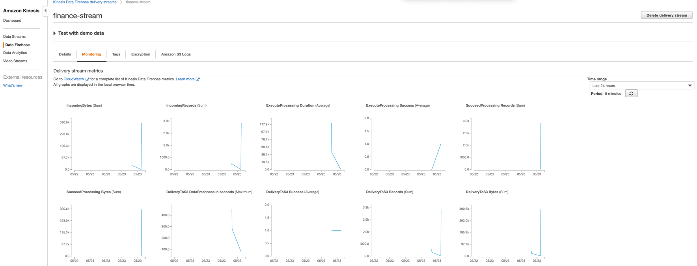

# Streaming Finance Data with AWS Lambda

## DataCollector

### Lambda Function URL

- API endpoint: https://1253iy35aa.execute-api.us-east-1.amazonaws.com/default/finance-stream-collector

### Lambda Function Source Code

- `data_collector.py`

```
import json
import boto3
import os
import subprocess
import sys

subprocess.check_call([sys.executable, "-m", "pip", "install", "--target", "/tmp", 'yfinance'])
sys.path.append('/tmp')

import yfinance as yf

tickers = ['FB', 'SHOP', 'BYND', 'NFLX', 'PINS', 'SQ', 'TTD', 'OKTA', 'SNAP', 'DDOG']
start = '2020-05-14'
end = '2020-05-15'

def lambda_handler(event, context):
    fh = boto3.client("firehose", "us-east-1")
    for ticker in tickers:
        data = yf.download(ticker, start=start, end=end, interval = "1m")
        for datetime, row in data.iterrows():
            output = {'name': ticker}
            output['high'] = row['High']
            output['low'] = row['Low']
            output['ts'] = str(datetime)
            as_jsonstr = json.dumps(output)
            fh.put_record(
                DeliveryStreamName="finance-stream", 
                Record={"Data": as_jsonstr.encode('utf-8')})
    return {
        'statusCode': 200,
        'body': json.dumps(f'Done! Recorded: {as_jsonstr}')
    }
```

## DataTransformer

### AWS Kinesis Firehose Delivery Stream 

- Monitoring Page




## DataAnalyzer

- `query.sql`

```
SELECT upper(name) AS Name, round(high,2) AS High, ts AS Timestamp, hour AS Hour
FROM(
  select db.*, SUBSTRING(ts, 12, 2) AS Hour, ROW_NUMBER() OVER(PARTITION BY name, SUBSTRING(ts, 12, 2) ORDER BY high) AS rn
  FROM "23" db
  WHERE ts between '2020-05-14 09:30:00' AND '2020-05-14 16:00:00'
) db1 WHERE rn=1 ORDER BY name, ts
```

- `results.csv`

|  Name  |  High    |  Timestamp                  |  Hour  |
|--------|----------|-----------------------------|--------|
|  BYND  |  132.49  |  2020-05-14 09:54:00-04:00  |  9     |
|  BYND  |  133.11  |  2020-05-14 10:02:00-04:00  |  10    |
|  BYND  |  135.85  |  2020-05-14 11:59:00-04:00  |  11    |
|  BYND  |  135.92  |  2020-05-14 12:08:00-04:00  |  12    |
|  BYND  |  134.6   |  2020-05-14 13:58:00-04:00  |  13    |
|  BYND  |  134.19  |  2020-05-14 14:03:00-04:00  |  14    |
|  BYND  |  134.29  |  2020-05-14 15:22:00-04:00  |  15    |
|  DDOG  |  64.79   |  2020-05-14 09:56:00-04:00  |  9     |
|  DDOG  |  63.13   |  2020-05-14 10:31:00-04:00  |  10    |
|  DDOG  |  63.75   |  2020-05-14 11:46:00-04:00  |  11    |
|  DDOG  |  62.97   |  2020-05-14 12:14:00-04:00  |  12    |
|  DDOG  |  63.09   |  2020-05-14 13:58:00-04:00  |  13    |
|  DDOG  |  62.93   |  2020-05-14 14:35:00-04:00  |  14    |
|  DDOG  |  63.95   |  2020-05-14 15:01:00-04:00  |  15    |
|  FB    |  201.09  |  2020-05-14 09:54:00-04:00  |  9     |
|  FB    |  200.84  |  2020-05-14 10:02:00-04:00  |  10    |
|  FB    |  202.83  |  2020-05-14 11:01:00-04:00  |  11    |
|  FB    |  202.74  |  2020-05-14 12:03:00-04:00  |  12    |
|  FB    |  204.15  |  2020-05-14 13:08:00-04:00  |  13    |
|  FB    |  203.56  |  2020-05-14 14:50:00-04:00  |  14    |
|  FB    |  204.17  |  2020-05-14 15:01:00-04:00  |  15    |
|  NFLX  |  443.15  |  2020-05-14 09:54:00-04:00  |  9     |
|  NFLX  |  441.26  |  2020-05-14 10:58:00-04:00  |  10    |
|  NFLX  |  433.63  |  2020-05-14 11:59:00-04:00  |  11    |
|  NFLX  |  434.65  |  2020-05-14 12:00:00-04:00  |  12    |
|  NFLX  |  439.18  |  2020-05-14 13:19:00-04:00  |  13    |
|  NFLX  |  438.64  |  2020-05-14 14:42:00-04:00  |  14    |
|  NFLX  |  438.56  |  2020-05-14 15:18:00-04:00  |  15    |
|  OKTA  |  174.13  |  2020-05-14 09:54:00-04:00  |  9     |
|  OKTA  |  175.77  |  2020-05-14 10:02:00-04:00  |  10    |
|  OKTA  |  177.13  |  2020-05-14 11:00:00-04:00  |  11    |
|  OKTA  |  176.46  |  2020-05-14 12:17:00-04:00  |  12    |
|  OKTA  |  176.29  |  2020-05-14 13:53:00-04:00  |  13    |
|  OKTA  |  176.26  |  2020-05-14 14:05:00-04:00  |  14    |
|  OKTA  |  176.57  |  2020-05-14 15:53:00-04:00  |  15    |
|  PINS  |  15.9    |  2020-05-14 09:54:00-04:00  |  9     |
|  PINS  |  15.9    |  2020-05-14 10:02:00-04:00  |  10    |
|  PINS  |  16.52   |  2020-05-14 11:59:00-04:00  |  11    |
|  PINS  |  16.57   |  2020-05-14 12:02:00-04:00  |  12    |
|  PINS  |  16.8    |  2020-05-14 13:59:00-04:00  |  13    |
|  PINS  |  16.74   |  2020-05-14 14:02:00-04:00  |  14    |
|  PINS  |  16.88   |  2020-05-14 15:00:00-04:00  |  15    |
|  SHOP  |  736.01  |  2020-05-14 09:54:00-04:00  |  9     |
|  SHOP  |  738.03  |  2020-05-14 10:02:00-04:00  |  10    |
|  SHOP  |  743.78  |  2020-05-14 11:00:00-04:00  |  11    |
|  SHOP  |  744.41  |  2020-05-14 12:02:00-04:00  |  12    |
|  SHOP  |  749.37  |  2020-05-14 13:59:00-04:00  |  13    |
|  SHOP  |  744.8   |  2020-05-14 14:35:00-04:00  |  14    |
|  SHOP  |  749.03  |  2020-05-14 15:15:00-04:00  |  15    |
|  SNAP  |  16.5    |  2020-05-14 09:56:00-04:00  |  9     |
|  SNAP  |  16.49   |  2020-05-14 10:02:00-04:00  |  10    |
|  SNAP  |  16.68   |  2020-05-14 11:47:00-04:00  |  11    |
|  SNAP  |  16.68   |  2020-05-14 12:08:00-04:00  |  12    |
|  SNAP  |  16.82   |  2020-05-14 13:58:00-04:00  |  13    |
|  SNAP  |  16.74   |  2020-05-14 14:06:00-04:00  |  14    |
|  SNAP  |  16.83   |  2020-05-14 15:41:00-04:00  |  15    |
|  SQ    |  71.38   |  2020-05-14 09:54:00-04:00  |  9     |
|  SQ    |  71.55   |  2020-05-14 10:02:00-04:00  |  10    |
|  SQ    |  74.79   |  2020-05-14 11:59:00-04:00  |  11    |
|  SQ    |  74.89   |  2020-05-14 12:02:00-04:00  |  12    |
|  SQ    |  76.03   |  2020-05-14 13:59:00-04:00  |  13    |
|  SQ    |  75.68   |  2020-05-14 14:02:00-04:00  |  14    |
|  SQ    |  77.01   |  2020-05-14 15:18:00-04:00  |  15    |
|  TTD   |  282.19  |  2020-05-14 09:54:00-04:00  |  9     |
|  TTD   |  281.77  |  2020-05-14 10:00:00-04:00  |  10    |
|  TTD   |  289.21  |  2020-05-14 11:59:00-04:00  |  11    |
|  TTD   |  288.73  |  2020-05-14 12:08:00-04:00  |  12    |
|  TTD   |  292.18  |  2020-05-14 13:05:00-04:00  |  13    |
|  TTD   |  291.41  |  2020-05-14 14:07:00-04:00  |  14    |
|  TTD   |  295.55  |  2020-05-14 15:01:00-04:00  |  15    |
